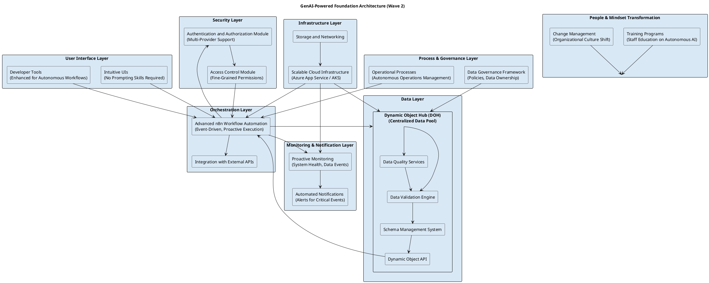
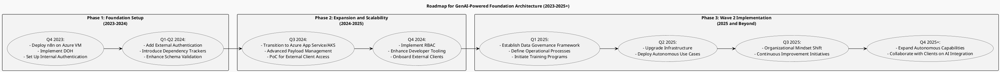
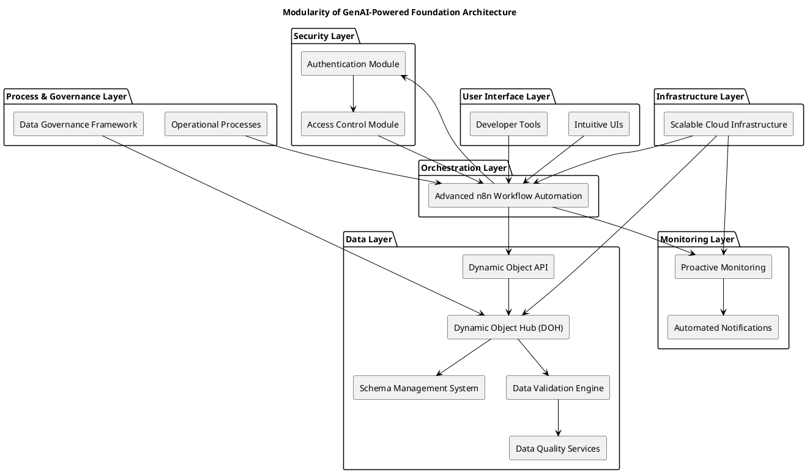
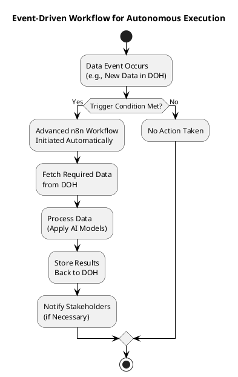
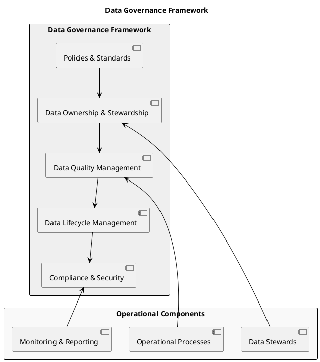

[!(https://web-plantuml-server-effrajf5ethpebd3.germanywestcentral-01.azurewebsites.net/png/VLLjRzis4FwkNt5jWIm6QcmOC23xKa2pdSHO_BB8RVUXGC58bCr58ZMIafiC_UyxlbZK6velaU_kETvplEVu9gCvunGULuj3lBrxM7rTx1vsZ_1k-VlgvlQtwCt8VrZzVRW4_MB_eaWzCruHIKgGDDM47miA_qK0Vv3q-IX5pRE5A8GSdc8YXCoe77h36HXoAxZ-GS3tAD9Cuu5tbCVh-LwSgQGPel1KefdW4Clqn3GMLaiArvz9G-7NMHJz14l7hI0lLAeebFxsew8IrbnJcPEKmeC9U0j4GStijoNNYSVGccc6YJ-krHT-lHMmbwAiDED7I9vPKIXufF_M32kRsKJiWa10FzUIDhGG5Hvo4A8msLRyH7YAd7BiGLnhmKKfQWMVXNpE2t5MBcL66uim7Udaso5xghHqlGXKHDS-oIhE6dSkl-7jORQ0qe9CQGtbUhwKI8I_Dvn9Qjkm-aRJsiIuqeZFjBtXeyRHeo_jpFG9WTXqJWg8zsjbiTHRZ650RKaqwJ32woQJH9Old9GiXTtJFsY4-_e9hfUx-naIM63zaXJi5MdQT7jieU-dEDb4_LGcvgyQ4Ve54YeRbbBLdkuTaw1FwF83kU97d3kBQbghCmwX2LvIIM13E3dI4ek5v4LfMbgmiixDiTIZ4_kCiNUkHcV6dmZuFkXcWbSc3QtGKULDq-DHwnCMn597Yl3CpCP9IFRgB1kHrGN59c_gGhCvJaV3KEoGr5KbfFQZWH0NECYUOcCLB53yKXGXroqsQNud2VxBO4zboPJ2mxm6Y4Lvq83VHd2ciJgKv1LiXMRvfVH0k6nZ9Yc70G_9i2Pt9N1FIQ5FxzqSMMNuggeBBA16hJIQGaRTkepsuu9AhQpo5tWJw2bwgNatVa0OgxKzl88xqHWDyTukExR6QT4O5XtWBQvtUiOjW5NjHS5IHfNdkZjpNA0dLirQ9GHWF-iE5vij5ddu-gZb6TPQ6w8wO-yoYu1kmGFIQvvBWckjTki-q6KznoJb1BjBdl1hKOWwWtugK-IhIHbNrKNvy3F4VoOpBqO7jgX1Nhnpv64bigNQD157mA6SArY7TqX5XV-lOCDufgY6WoHSuJYu5Up6oyPCCZeOePY9ntRXdYrDgnDDyXnMMUsdtxoGeVlnsj7H7da1zlCky4L2Gk5-CEzE7WdtsiVRNQ3eJRkI4ylzzQKM5K26Q_iAC_FS6fcOGUu-Zp2VV-Yz89U7RkJeV5iVRl2HhVUSc1Ll0pkx-s8RRUPEq7J0q62ZEZiwVBf3mp8EdoDE8m9JosJ2PcFxss6OgRDwmwVpzDPexzUumBxSsyPFQNKCxgbcv1vxJUQnTQed8sNvw-YgD1fEkSiMz1GDHtOOy3y0)]

https://web-plantuml-server-effrajf5ethpebd3.germanywestcentral-01.azurewebsites.net/uml/VLLjRzis4FwkNt5jWIm6QcmOC23xKa2pdSHO_BB8RVUXGC58bCr58ZMIafiC_UyxlbZK6velaU_kETvplEVu9gCvunGULuj3lBrxM7rTx1vsZ_1k-VlgvlQtwCt8VrZzVRW4_MB_eaWzCruHIKgGDDM47miA_qK0Vv3q-IX5pRE5A8GSdc8YXCoe77h36HXoAxZ-GS3tAD9Cuu5tbCVh-LwSgQGPel1KefdW4Clqn3GMLaiArvz9G-7NMHJz14l7hI0lLAeebFxsew8IrbnJcPEKmeC9U0j4GStijoNNYSVGccc6YJ-krHT-lHMmbwAiDED7I9vPKIXufF_M32kRsKJiWa10FzUIDhGG5Hvo4A8msLRyH7YAd7BiGLnhmKKfQWMVXNpE2t5MBcL66uim7Udaso5xghHqlGXKHDS-oIhE6dSkl-7jORQ0qe9CQGtbUhwKI8I_Dvn9Qjkm-aRJsiIuqeZFjBtXeyRHeo_jpFG9WTXqJWg8zsjbiTHRZ650RKaqwJ32woQJH9Old9GiXTtJFsY4-_e9hfUx-naIM63zaXJi5MdQT7jieU-dEDb4_LGcvgyQ4Ve54YeRbbBLdkuTaw1FwF83kU97d3kBQbghCmwX2LvIIM13E3dI4ek5v4LfMbgmiixDiTIZ4_kCiNUkHcV6dmZuFkXcWbSc3QtGKULDq-DHwnCMn597Yl3CpCP9IFRgB1kHrGN59c_gGhCvJaV3KEoGr5KbfFQZWH0NECYUOcCLB53yKXGXroqsQNud2VxBO4zboPJ2mxm6Y4Lvq83VHd2ciJgKv1LiXMRvfVH0k6nZ9Yc70G_9i2Pt9N1FIQ5FxzqSMMNuggeBBA16hJIQGaRTkepsuu9AhQpo5tWJw2bwgNatVa0OgxKzl88xqHWDyTukExR6QT4O5XtWBQvtUiOjW5NjHS5IHfNdkZjpNA0dLirQ9GHWF-iE5vij5ddu-gZb6TPQ6w8wO-yoYu1kmGFIQvvBWckjTki-q6KznoJb1BjBdl1hKOWwWtugK-IhIHbNrKNvy3F4VoOpBqO7jgX1Nhnpv64bigNQD157mA6SArY7TqX5XV-lOCDufgY6WoHSuJYu5Up6oyPCCZeOePY9ntRXdYrDgnDDyXnMMUsdtxoGeVlnsj7H7da1zlCky4L2Gk5-CEzE7WdtsiVRNQ3eJRkI4ylzzQKM5K26Q_iAC_FS6fcOGUu-Zp2VV-Yz89U7RkJeV5iVRl2HhVUSc1Ll0pkx-s8RRUPEq7J0q62ZEZiwVBf3mp8EdoDE8m9JosJ2PcFxss6OgRDwmwVpzDPexzUumBxSsyPFQNKCxgbcv1vxJUQnTQed8sNvw-YgD1fEkSiMz1GDHtOKy3y0?view=previewer

# GenAI Foundation Architecture Strategy Overview

## Message From GPT:
# Updated High-Level Architecture Overview and Roadmap for GenAI-Powered Foundation Architecture (Incorporating Wave 2 Vision)

## Table of Contents

1. **Introduction**
2. **Enhanced Vision and Expectations**
3. **Architectural Approaches for Wave 2**
4. **Defined Layers and Components**
5. **Wave 2 Requirements and Enhancements**
6. **Scope and Use Cases**
7. **Updated Roadmap**
   - 7.1 **Phase 1: Foundation Setup (2023–2024)**
   - 7.2 **Phase 2: Expansion and Scalability (2024–2025)**
   - 7.3 **Phase 3: Wave 2 Implementation (2025 and Beyond)**
8. **Conclusion**
9. **Next Steps**

---

## 1. Introduction

AdEx Partners is advancing its GenAI transformation journey by embracing "Wave 2" of AI implementation. This phase emphasizes autonomous data access, proactive execution, and the simplification of user interaction—eliminating the need for prompting skills. This updated document integrates the Wave 2 vision into our high-level architecture overview and roadmap, detailing how we will evolve our systems, processes, and organizational mindset to meet the new requirements and achieve our objectives by 2025.

---

## 2. Enhanced Vision and Expectations

**Wave 2 Vision:**

- **Autonomous Operations:** GenAI use cases will operate independently, accessing and updating data without manual intervention.
- **Proactive Execution:** Use cases will initiate automatically in response to new data availability or predefined triggers.
- **Simplified User Interaction:** Systems are designed so that users do not need prompting skills; interaction is intuitive and minimal.

**Expectations:**

- **Data-Driven Decision Making:** Enhanced data quality and governance will support smarter, autonomous decisions.
- **Streamlined Processes:** Establishment of efficient processes to support autonomous use cases and data management.
- **Organizational Alignment:** Align people and mindset to embrace automation and proactive AI solutions.

---

## 3. Architectural Approaches for Wave 2

To realize the Wave 2 vision, the following architectural approaches will be adopted and enhanced:

**1. Event-Driven Architecture:**

- Implementing an architecture where system components respond to data events and changes, enabling real-time processing and proactive actions.

**2. Enhanced Data Governance:**

- Strengthening data quality, ownership, and management practices to support reliable autonomous operations.

**3. Modular and Scalable Design:**

- Ensuring that system components are modular to allow for scalability and easy integration of new functionalities.

**4. Focus on User Experience:**

- Simplifying interfaces and interactions to reduce the need for specialized skills, making AI accessible to all users.

---

## 4. Defined Layers and Components

### **User Interface Layer**

- **Intuitive UIs:** Simplified interfaces for users, minimizing the need for technical expertise.
- **Developer Tools:** Enhanced tools for developers to manage autonomous workflows and monitor system performance.

### **Orchestration Layer**

- **Advanced n8n Workflow Automation:**

  - Enhanced to support event-driven, autonomous execution.
  - Integration with data events to trigger workflows automatically.

### **Data Layer**

- **Dynamic Object Hub (DOH):**

  - Centralized, high-quality data repository accessible by all use cases.
  - Enhanced data structures to support autonomous operations.

- **Data Quality and Validation Services:**

  - Services to ensure data accuracy, completeness, and reliability.

### **Security Layer**

- **Robust Access Control:**

  - Fine-grained permissions to secure autonomous data access and operations.
  - Continuous monitoring for compliance and security threats.

### **Monitoring and Notification Layer**

- **Proactive Monitoring:**

  - Systems to monitor data events, system health, and use case performance in real-time.

- **Automated Notifications:**

  - Alerts and notifications for critical events or anomalies detected during autonomous operations.

### **Process and Governance Layer**

- **Data Governance Framework:**

  - Policies and procedures for data management, quality assurance, and compliance.

- **Operational Processes:**

  - Defined processes for handling autonomous operations, incident management, and continuous improvement.

### **People and Mindset Transformation**

- **Training Programs:**

  - Initiatives to educate and train staff on new systems and autonomous AI concepts.

- **Change Management:**

  - Strategies to shift organizational culture towards embracing automation and proactive technologies.

---

## 5. Wave 2 Requirements and Enhancements

To achieve the objectives of Wave 2, several new requirements and enhancements need to be addressed:

### **Data Quality and Structures**

- **Requirement:** Ensure that data in the DOH is of high quality and structured appropriately for autonomous access and processing.
- **Enhancements:**

  - Implement data validation rules and cleansing processes.
  - Establish standardized data models and schemas.

### **Data Ownership and Responsibilities**

- **Requirement:** Clearly define ownership and stewardship of data to maintain accountability.
- **Enhancements:**

  - Assign data stewards responsible for data quality and governance.
  - Document roles and responsibilities related to data management.

### **Processes and Workflows**

- **Requirement:** Develop processes to support autonomous operations and data lifecycle management.
- **Enhancements:**

  - Create workflows for data ingestion, processing, and archiving.
  - Establish incident response procedures for handling exceptions or errors.

### **Technology Upgrades**

- **Requirement:** Enhance the technological infrastructure to support increased automation and scalability.
- **Enhancements:**

  - Upgrade infrastructure components for better performance.
  - Implement scalable cloud solutions capable of handling higher workloads.

### **Security and Compliance**

- **Requirement:** Strengthen security measures to protect autonomous operations and comply with regulations.
- **Enhancements:**

  - Implement advanced authentication and authorization mechanisms.
  - Conduct regular security audits and compliance checks.

### **People and Organizational Mindset**

- **Requirement:** Prepare the workforce to adapt to and support autonomous AI solutions.
- **Enhancements:**

  - Offer training and development programs.
  - Promote a culture that values innovation and continuous improvement.

---

## 6. Scope and Use Cases

### **Scope Expansion**

- **Scope A:** Internal operations to be fully automated where feasible, improving efficiency and effectiveness.
- **Scope B:** External client offerings will include autonomous AI solutions that deliver proactive insights and actions.
- **Scope C:** Collaborative projects with clients, integrating autonomous AI capabilities within their systems.

### **Use Case Evolution**

- **From Manual to Autonomous:** Transition existing use cases to operate without manual intervention.
- **Proactive Initiatives:** Develop new use cases that can identify opportunities or issues and act on them proactively.

### **Roles and Responsibilities**

- **Data Stewards:** Ensure data integrity and manage data-related issues.
- **AI Operations Team:** Monitor autonomous systems and address any operational challenges.
- **Change Agents:** Lead the organizational shift towards embracing autonomous AI.

---

## 7. Updated Roadmap

### **7.1 Phase 1: Foundation Setup (2023–2024)**

- **Q4 2023:**

  - Complete initial deployment of n8n and DOH.
  - Set up internal authentication and begin developing foundational workflows.

- **Q1–Q2 2024:**

  - Introduce external authentication support and dependency trackers.
  - Begin enhancing schema validation and security measures.

### **7.2 Phase 2: Expansion and Scalability (2024–2025)**

- **Q3 2024:**

  - Transition infrastructure to support greater scalability (Azure App Service/AKS).
  - Develop advanced payload and data management capabilities.

- **Q4 2024:**

  - Implement role-based access control and enhance developer tooling.
  - Start onboarding external clients and integrating their feedback.

### **7.3 Phase 3: Wave 2 Implementation (2025 and Beyond)**

**Q1 2025:**

- **Data Governance Framework:**

  - Establish policies and appoint data stewards.
  - Implement data quality metrics and monitoring tools.

- **Process Development:**

  - Define operational processes for autonomous use cases.
  - Develop training materials and conduct initial workshops.

**Q2 2025:**

- **Infrastructure Enhancements:**

  - Upgrade systems to support event-driven architecture.
  - Implement real-time data processing capabilities.

- **Autonomous Use Cases Deployment:**

  - Transition existing use cases to operate autonomously.
  - Begin developing new proactive use cases.

**Q3 2025:**

- **People and Mindset Shift:**

  - Roll out comprehensive training programs.
  - Initiate change management strategies to foster adoption.

- **Continuous Improvement:**

  - Set up feedback mechanisms to collect insights from users and stakeholders.
  - Refine systems and processes based on feedback.

**Q4 2025 and Beyond:**

- **Expansion of Autonomous Capabilities:**

  - Introduce more sophisticated AI models and use cases.
  - Collaborate with clients to integrate autonomous solutions into their operations.

- **Monitoring and Optimization:**

  - Continuously monitor system performance and make necessary adjustments.
  - Stay abreast of emerging technologies to keep the infrastructure up-to-date.

---

## 8. Conclusion

By integrating the Wave 2 vision into our architecture and roadmap, AdEx Partners is positioned to leverage the full potential of GenAI technologies. The focus on autonomous operations, proactive execution, and user-friendly interfaces will not only enhance internal efficiencies but also provide significant value to our clients. Preparing for this next phase requires concerted efforts across technology, data management, processes, and people, ensuring all components work harmoniously towards our goals.

---

## 9. Next Steps

- **Detailed Planning:**

  - Develop detailed project plans for Wave 2 initiatives.
  - Identify resource requirements and allocate budgets accordingly.

- **Stakeholder Engagement:**

  - Communicate the updated vision and roadmap to all stakeholders, including internal teams and clients.
  - Seek feedback and buy-in to ensure alignment and support.

- **Kick-off Initiatives:**

  - Begin implementing data governance frameworks and processes.
  - Initiate infrastructure upgrades and technology enhancements.

- **Training and Development:**

  - Schedule training sessions and workshops for staff.
  - Provide resources and support for skill development.

- **Monitor Progress:**

  - Establish KPIs to track the progress of Wave 2 implementation.
  - Regularly review and adjust plans as necessary based on performance and feedback.

---

By proactively embracing the Wave 2 vision, AdEx Partners will not only keep pace with technological advancements but set a benchmark in the industry for innovative and effective use of GenAI technologies. The focus on autonomous, proactive, and user-friendly solutions promises to deliver significant benefits, driving us towards a successful transformation by 2025.

## Message From GPT:
Below are updated **PlantUML diagrams** to support discussions on the GenAI-powered foundation architecture, incorporating the Wave 2 vision. These diagrams cover the architecture, roadmap, modularity, and security aspects.

---

## **1. Architecture Diagram**



This diagram represents the updated architecture incorporating Wave 2 enhancements. It showcases the layers and components, highlighting autonomous operations, enhanced data management, and organizational transformation.

---

## **2. Roadmap Diagram**



This roadmap diagram outlines the phases and key milestones from the initial foundation setup to the full implementation of Wave 2 by 2025 and beyond.

---

## **3. Modularity Diagram**



This diagram illustrates the modular components of the architecture and how they interact, emphasizing the independence and reusability of each module.

---

## **4. Security Diagram**

```plantuml
@startuml
!define ICONURL https://raw.githubusercontent.com/tupadr3/plantuml-icon-font-sprites/master
!include ICONURL/common.puml
!include ICONURL/fa/users.puml
!include ICONURL/fa/server.puml
!include ICONURL/fa/key.puml
!include ICONURL/fa/lock.puml
!include ICONURL/fa/database.puml

skinparam backgroundColor #FFFFFF
skinparam Arrow {
  Color #000000
}
skinparam {
  ArrowFontColor black
  ArrowThickness 1
  ArrowColor black
  DefaultFontColor black
  NodeFontColor black
}

title Security Architecture – Authentication and Authorization Module

rectangle "User" as user #F9F9F9
rectangle "Authentication Module" as authModule #EFEFEF
database "Internal Entra AD\n(GenAI Hub)" as internalAD #D9E8F5
database "External Entra ADs\n(Trusted Providers)" as externalAD #D9E8F5
rectangle "Access Control Module\n(Role-Based Access Control)" as accessControl #EFEFEF
rectangle "Protected Resources\n(APIs, Data, Workflows)" as resources #F9F9F9

cloud "External Identity Providers" as externalProviders #F0F0F0

user --> authModule : Login Request
authModule --> internalAD : Internal Auth Request
authModule --> externalAD : External Auth Request
externalAD --> externalProviders : Federated Authentication

authModule --> user : JWT Token with Claims
user --> accessControl : Request Access with Token
accessControl --> resources : Grant/Deny Access

rectangle "Security Features" as features #FFFFFF

features *-right- authModule
features *-down- accessControl

note right of features
- Multi-Provider Authentication
- JWT Tokens with Claims
- Token Refresh and Revocation
- Fine-Grained Permissions
- Audit Logging
end note

@enduml
```

This security diagram focuses on the authentication and authorization module, illustrating how users authenticate via internal and external Entra ADs, receive JWT tokens, and access protected resources through the access control module.

---

## **5. Event-Driven Workflow Diagram**



This diagram represents the flow of an autonomous, event-driven workflow where data events trigger automatic execution of workflows without manual intervention.

---

## **6. Data Governance Framework Diagram**



This diagram outlines the components of the data governance framework, showing the relationships between policies, data ownership, quality management, lifecycle management, and compliance.

---

These diagrams can be used to facilitate discussions and provide a visual representation of the GenAI-powered foundation architecture, helping stakeholders understand the complex interactions and planned developments as we move towards Wave 2 implementation.

---

**Note:** To view these diagrams, you can use a PlantUML viewer or an online rendering tool like [PlantUML Online Server](http://www.plantuml.com/plantuml/), [PlantText](https://www.planttext.com/), or integrate with an IDE that supports PlantUML.
---

Breakdown of the architecture into modular components, each described as  "Technology" items. These components ensure modularity, scalability, and reusability while avoiding a monolithic design.

---

### **Title:** Schema Management System  
**Summary:**  
**Situation/Context:** The system requires dynamic schemas to define object structures without database migrations. These schemas must ensure data integrity and flexibility for evolving use cases.  
**Problem Statement:** Frequent schema changes can disrupt dependent function calls and use cases. A robust management system is needed to handle schema definitions, enforce validation, and prevent disruptive changes.  
**Solution Idea:** Implement a schema management system that validates object data against dynamic schemas, tracks schema dependencies (e.g., function calls, use cases), and prevents breaking changes.  
**Detailed Design:**  
- Centralized schema repository with version control.  
- API endpoints to fetch, update, and manage schemas (`/api/objects/schemas`).  
- Validation logic to ensure data consistency.  
- Dependency tracking for object-node-paths used in function calls (`includedInFunctionCall`) and use cases (`includedInUseCase`).  
- UI for developers to register schema dependencies.  
- Integration with schema modification tools to block breaking changes.  

---

### **Title:** Function Call Dependency Tracker  
**Summary:**  
**Situation/Context:** Function calls in AI use cases rely on specific object-node-paths. Changes to these paths can cause failures, requiring a dependency tracking mechanism.  
**Problem Statement:** There is no existing system to monitor and enforce the registration of object-node-paths used in function calls. This creates risks of unintentional disruptions.  
**Solution Idea:** Develop a tracker that registers object-node-paths used in function calls, provides visibility into these dependencies, and prevents schema changes that could break them.  
**Detailed Design:**  
- Event type `includedInFunctionCall` to track object-node-paths.  
- API endpoint (`/api/object/functionCalls/:object`) to expose all registered dependencies for a given object.  
- UI for developers to register and manage dependencies.  
- Integration with schema modification tools to block breaking changes.  

---

### **Title:** Use Case Dependency Tracker  
**Summary:**  
**Situation/Context:** AI use cases depend on function calls, which in turn rely on object-node-paths. A system is needed to track these relationships and identify critical dependencies.  
**Problem Statement:** There is no visibility into how function calls and object-node-paths are linked to specific use cases, making it difficult to assess the impact of changes.  
**Solution Idea:** Create a tracker that registers function calls linked to use cases and exposes these relationships for monitoring and impact analysis.  
**Detailed Design:**  
- Event type `includedInUseCase` to track function call dependencies.  
- API endpoint (`/api/object/useCases/:functionCall`) to expose all use cases that rely on a given function call.  
- UI for monitoring, registering, and describing use case dependencies.  
- Integration with schema and function call tools to identify critical changes.  

---

### **Title:** Dynamic Object API  
**Summary:**  
**Situation/Context:** The platform requires a flexible API to manage object data, perform CRUD operations, and support dynamic schemas.  
**Problem Statement:** Traditional APIs with rigid data structures cannot adapt to evolving use cases or dynamic schemas.  
**Solution Idea:** Implement a dynamic object API that supports flexible object management, validation against schemas, and efficient querying.  
**Detailed Design:**  
- CRUD endpoints for objects (`/api/objects/:objectType`).  
- Validation logic to enforce schema rules.  
- Full-text search and filtering capabilities (`/api/objects/:objectType/search`).  
- Pagination and field selection for efficient data retrieval.  
- Support for multi-select fields and nested structures.  

---

### **Title:** Schema Validation and Enforcement Engine  
**Summary:**  
**Situation/Context:** Object data must conform to schema definitions to ensure data integrity and prevent inconsistencies.  
**Problem Statement:** Without validation, invalid data can lead to downstream failures in function calls and use cases.  
**Solution Idea:** Build a validation engine that checks object data against schema definitions and enforces constraints.  
**Detailed Design:**  
- Real-time validation during object creation and updates.  
- Support for complex constraints (e.g., required fields, enums, nested structures).  
- Integration with the dynamic object API and schema management system.  
- Error handling and detailed feedback for developers.  

---

### **Title:** Authentication and Access Control Module  
**Summary:**  
**Situation/Context:** The system must ensure secure access to APIs while allowing role-based permissions for different users.  
**Problem Statement:** Unauthorized access to APIs or sensitive data could compromise the system’s security.  
**Solution Idea:** Implement a robust authentication and access control module using JWT tokens and role-based permissions.  
**Detailed Design:**  
- JWT-based authentication for all API endpoints.  
- Role-based access control to restrict operations based on user roles.  
- Integration with schema and object APIs to enforce permissions.  

---

### **Title:** Event Notification and Monitoring System  
**Summary:**  
**Situation/Context:** Changes to schemas, function calls, or use cases can have cascading impacts. A notification system is required to alert stakeholders.  
**Problem Statement:** Lack of visibility into critical changes can lead to missed dependencies and failures.  
**Solution Idea:** Build an event notification system that tracks changes and alerts relevant stakeholders.  
**Detailed Design:**  
- Event types for schema changes, function call updates, and use case modifications.  
- Notification channels (e.g., email, Slack) for alerts.  
- Integration with dependency trackers to highlight critical impacts.  

---

### **Title:** Developer Tooling and UI for Dependency Management  
**Summary:**  
**Situation/Context:** Developers need tools to register, monitor, and manage dependencies between schemas, function calls, and use cases.  
**Problem Statement:** Manual tracking of dependencies is error-prone and inefficient.  
**Solution Idea:** Provide a developer-friendly UI for managing dependencies and monitoring impacts.  
**Detailed Design:**  
- UI for registering object-node-paths in function calls and use cases.  
- Visualization of dependency relationships.  
- Integration with APIs for schema modification and monitoring.  

---

### **Title:** Payload Management and Optimization  
**Summary:**  
**Situation/Context:** Large datasets can impact API performance and usability. Payload size must be managed effectively.  
**Problem Statement:** Excessive payload sizes can lead to slow responses and inefficient data handling.  
**Solution Idea:** Implement strategies for payload management, including truncation, pagination, and field selection.  
**Detailed Design:**  
- Automatic truncation for large responses.  
- Pagination with configurable limits.  
- Field selection to retrieve only necessary data.  

---

By breaking the architecture into these modular components, development can progress independently for each module, enabling parallel workstreams and reusability across different contexts. The modular design also ensures scalability and maintainability over time.
